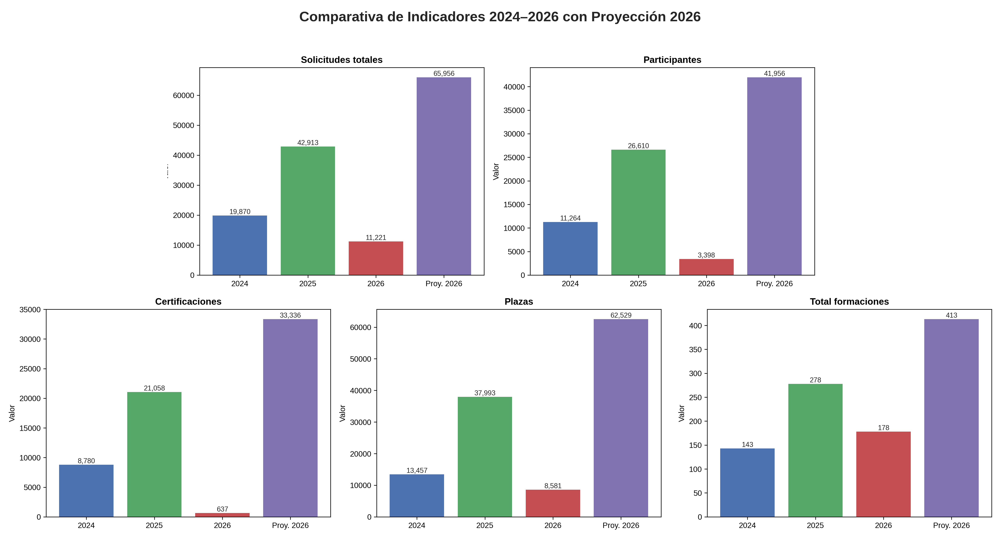

---
# Front matter
# Metainformació del document
title: Informe sobre formaciones del CEFIRE FP
titlepage: true
# author:
lang: es
# Uncomment and provide the image files to enable background images:
page-background: portadas/bg.png
# colorlinks: true

# portada
titlepage-rule-height: 2
titlepage-rule-color: "000000"
titlepage-text-color: "000000"
# Uncomment and provide the image file to enable a custom title page background:
titlepage-background: portadas/portada.png

# configuració de l'índex
toc-own-page: true
toc-title: Contenidos
toc-depth: 2
toc-title-color: "000000"

# capçalera i peu
header-left: Informe
header-right:
footer-left: CEFIRE FP
footer-right: \thepage/\pageref{LastPage}

# Les figures que apareguen on les definim i centrades
float-placement-figure: H
caption-justification: centering

# No volem numerar les linies de codi
listings-disable-line-numbers: true

table-use-row-colors: true

# Configuracions dels paquets de latex
header-includes:

  #  imatges i subfigures
  - \usepackage{graphicx}
  - \usepackage{subfigure}
  - \usepackage{lastpage}
  - \usepackage{booktabs}
  # Per a fer tables en LATEX
  - \usepackage[table]{xcolor}
  - \setlength{\arrayrulewidth}{0.1mm}
  - \setlength{\tabcolsep}{12pt}
  - \renewcommand{\arraystretch}{2}
  - \newcolumntype{s}{>{\columncolor[HTML]{AAACED}} p{3cm}}
  - \arrayrulecolor[HTML]{d4d5c3}

  # caixes d'avisos
  - \usepackage{awesomebox}

  # text en columnes
  - \usepackage{multicol}
  - \setlength{\columnseprule}{1pt}
  - \setlength{\columnsep}{1em}

  # pàgines apaïsades
  - \usepackage{pdflscape}

  # per a permetre pandoc dins de blocs Latex
  - \newcommand{\hideFromPandoc}[1]{#1}
  - \hideFromPandoc {
      \let\Begin\begin
      \let\End\end
    }

# definició de les caixes d'avis
pandoc-latex-environment:
  noteblock: [note]
  tipblock: [tip]
  warningblock: [warning]
  cautionblock: [caution]
  importantblock: [important]
...

# Introducción

El siguiente informe muestra la realización de formaciones durante el año natural 2025 y 2026 hasta la fecha. Que comprendería la realización de formaciones durante el segundo y tercer trimestre del cursos 24-25 y el primer trimestre del curso 25-26. En este informe se detallan las formaciones gestionadas directamente por CEFIRE de Formación Profesional integrado organizativamente en la Dirección General de Formación Profesional. Aunque se recogen los datos de formaciones realizadas durante el 2024 para establecer tablas comparativas.

En este informe se reflejan las formaciones realizadas exclusivamente dirigidas al profesorado de Formación Profesional, no se incluyen formaciones dirigidas a otros colectivos como pueden ser el profesorado de enseñanzas artísticas o deportivas.

# Formaciones realizadas

## Formaciones por familias

A continuación se presenta una tabla de formaciones realizadas por familia profesional:

| **Fam.** | **2024** | **2025** | **2026** |
|-----|-----------|-----------|-----------|
| **Cualificaciones profesionales** | 1  | 0  | 0  |
| **Fam. Administración y gestión**          | 9  | 5  | 4  |
| **Fam. Agraria**                            | 5  |10  | 2  |
| **Fam. Artes gráficas**                     | 2  | 2  | 2  |
| **Fam. Comercio y marketing**               | 2  | 1  | 5  |
| **Fam. Edificación y obra civil**           | 2  | 2  | 3  |
| **Fam. Electricidad y electrónica**         | 11 | 17  | 9  |
| **Fam. Energia y agua**                     | 4  | 7  | 3  |
| **Fam. Fabricación mecánica**               | 2  | 7  | 4  |
| **Fam. Hostelería y turismo**               | 8  | 10  | 6  |
| **Fam. Imagen personal**                    | 18  | 30  | 24  |
| **Fam. Imagen y sonido**                    | 4  | 8  | 8  |
| **Fam. Informática y comunicaciones**       | 14  | 39  | 33  |
| **Fam. Instalación y mantenimiento**        | 9  | 25  | 7  |
| **Fam. Química**                            | 1  | 13  | 7  |
| **Fam. Sanidad**                            | 9  | 20  |13  |
| **Fam. Seguridad y medio ambiente**         | 4  | 12  | 2  |
| **Fam. Servicios Socioculturales y a la Comunidad** | 11 | 9 | 3 |
| **Fam. Textil, Confección y Piel**          | 3  | 1  | 4  |
| **Fam. Transporte y Mantenimiento de Vehículos** | 4 | 7 | 10 |
| **Transversal**                             | 16 | 32 | 6 |
| **Formación y Orientación laboral**         | 4 | 3 | 4 |
| **Fam. Madera, mueble y corcho**            | 0 | 3 | 2 |
| **Fam. Vidrio y Cerámica**                  | 0 | 2 | 2 |
| **FP - Calidad Educativa**                  | 0 | 1 | 4 |
| **Orientación Educativa**                   | 0 | 1 | 0 |
| **Fam. Actividades físicas y deportivas**   | 0 | 8 | 4 |
| **Fam. Industrias alimentarias**            | 0 | 3 | 4 |
| **Formación Profesional**                  | 0 | 0 | 3 |
| **TOTAL**                                  | 143 | 278 | 178 |

## Formaciones totales realizadas

En la siguiente tabla se muestra la evolución de las formaciones realizadas durante los años 2024, 2025 y 2026 hasta la fecha, con datos de inversión total, solicitudes totales, participantes, certificaciones, plazas y formaciones totales realizadas.

| Métrica               | 2024      | 2025      | 2026      |
|------------------------|-----------|-----------|-----------|
| Inversión total  | 218.628,05 €* | 681.352,97 € | 320.144,14 € |
| Solicitudes totales    | 19.870    | 42.913    | 11.221    |
| Participantes          | 11.264    | 26.610    | 3.398     |
| Certificaciones        | 8.780     | 21.058    | 637       |
| Plazas totales         | 13.457    | 37.993    | 8.581     |
| Formaciones totales    | 143       | 278       | 178       |

En 2026 se reflejan las formaciones planificadas hasta la fecha de las que se han certificado 9, por lo que el número de formaciones realizadas en este año es inferior al de años anteriores, aunque se espera que el número de formaciones realizadas en 2026 supere al de 2025. Asimismo el gasto proyectado hasta agosto de 2026 es de 369.103,12 €. Aún estamos en proceso de planificación de formaciones para el segundo semestre de 2026, por lo que se espera que el número de formaciones realizadas en 2026 supere al de 2025, aunque el gasto total de 2026 se espera que sea inferior al de 2025.

(*) Hay que tener en cuenta que se han tenido que gestionar los pagos de la mayoría de formaciones realizadas durante el año 2024 durante 2025 y lo que llevamos de 2026, por lo que el gasto real de ese año es muy inferior al reflejado en la tabla, aunque se ha incluido el gasto total para establecer una comparación con los años siguientes. La gestión de esos pagos se ha realizado con procedimientos ERESAR, y gestionando todas las minutas que se hicieron en su momento.

## Ratios de formaciones del curso 25-26

Durante el curso 25-26 se han realizado 209 formaciones hasta la fecha, con un total de 334 formaciones programadas y 14 formaciones en programación, con un total de 348 formaciones planificadas para el curso 25-26.

En la siguiente tabla se muestran las ratios de las formacions realizadas:

| Formaciones | Asesores | Formaciones asesor/curso |
|-------------|----------|-----------------------|
| 348         | 11        | 31.64                 |

# Proyectos FP

A todo esto hay que añadir las los proyectos realizados por los asesores que no se han incluido en esta tabla ni los eventos asociados a los mismos, entre ellos cabe destacar:

* Llança't: Proyecto de la DG de FP que convierte los Centros Integrados Públicos de FP en “viveros de empresa”, con mentorización y apoyo a egresados que quieren emprender.
* Quantic: Proyectos de innovación y digitalización
* Estancias en empresas para el profesorado de FP

Proyectos que requieren de especial atención por parte de los asesores, aunque no se han incluido en esta tabla, ya que no se han contabilizado como formaciones realizadas, aunque sí han requerido de una gran dedicación por parte de los asesores.

# Tareas paralelas a la gestión de formaciones

Cabe destacar que además de las formaciones realizadas, los asesores han realizado otras tareas relacionadas con la gestión de formaciones, como pueden ser:

* Gestión del PAF de los centros integrados de FP.
* Gestión de todas la facturas y minutas por pagar de cursos anteriores, gestionando los pagos a través de procedimientos ERESAR.
* Proyecto del Componente 19 habilitando a más de 6000 ciudadanos en Competencias Digitales Ciudadanas.
* Tareas de soporte a la Dirección General de Formación del profesorado de FP, como pueden ser la gestión de eventos como CVSkills, elaboración de informes, etc.
* Creación del espacio de Autoformación de la FP, donde se están adaptando los contenidos de los cursos realizados a Autoformación, se han gestionado 197 cursos los cuáles ya se han enviado a los responsables de Autoformación para su publicación.
